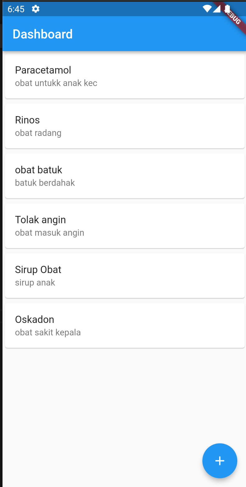
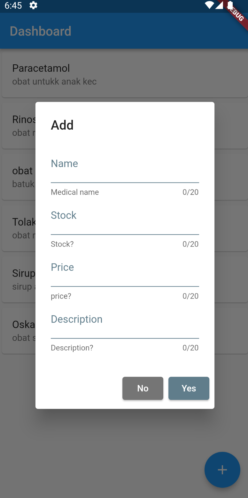
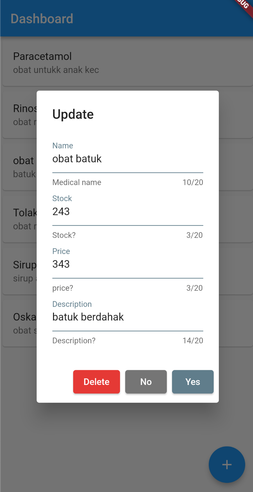

# Flutter Intensive Club

Flutter Integration API CRUD with Dio Packages, Backend used Strapi

## Youtube Link

https://youtu.be/x6CxeQUmyto

## Playlist Flutter Intensive Club

https://www.youtube.com/playlist?list=PLQvQbJRJpIZ67MrVzPDOYtAs7wmFjmFUI (https://www.youtube.com/playlist?list=PLQvQbJRJpIZ67MrVzPDOYtAs7wmFjmFUI)

## Roadmap Learing Flutter by Flutter Intensive Club (FIC)

https://miro.com/app/board/uXjVPKAz1i4=/?share_link_id=218530192751 (https://miro.com/app/board/uXjVPKAz1i4=/?share_link_id=218530192751)

## ScreenShot

| Home         | Add           |Update -Delete     |
|--------------|----------------|---------------|
|  |       |      |

